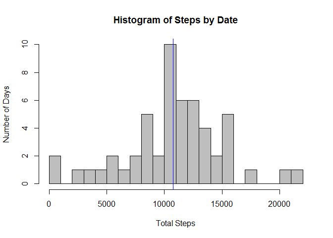
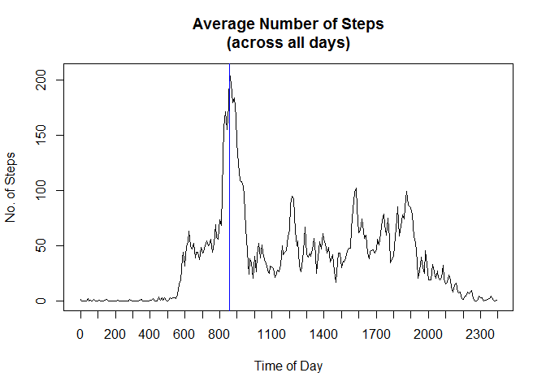
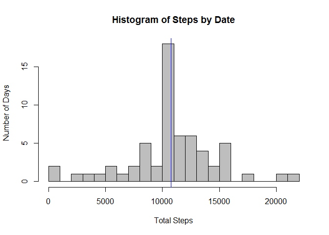
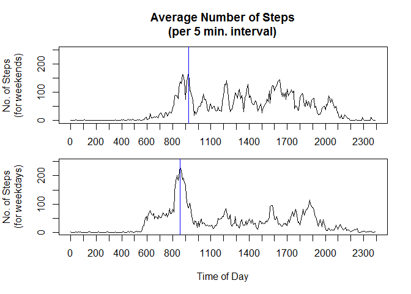

# An Exploratory Look at Data from Fitbit

### Introduction

It is now possible to collect a large amount of data about personal movement
using activity monitoring devices such as Fitbit, Nike Fuelband, and Jawbone Up. 
This assignment will make use of data from one such monitoring device,
which collects data at 5 minute intervals. Our sample consists of two months of 
data from an anonymous individual and includes the number of steps
he or she took throughout the day.  Let's take a quick look at the data.
(We've converted the $date field from a factor back to Date type, so that tapply() calls 
will behave as expected, droping values that are not encountered.)


```r
data = read.csv(unz("activity.zip", "activity.csv"))
data$date = as.Date(data$date)
str(data)
## 'data.frame':	17568 obs. of  3 variables:
##  $ steps   : int  NA NA NA NA NA NA NA NA NA NA ...
##  $ date    : Date, format: "2012-10-01" "2012-10-01" ...
##  $ interval: int  0 5 10 15 20 25 30 35 40 45 ...
summary(data)
##      steps             date               interval     
##  Min.   :  0.00   Min.   :2012-10-01   Min.   :   0.0  
##  1st Qu.:  0.00   1st Qu.:2012-10-16   1st Qu.: 588.8  
##  Median :  0.00   Median :2012-10-31   Median :1177.5  
##  Mean   : 37.38   Mean   :2012-10-31   Mean   :1177.5  
##  3rd Qu.: 12.00   3rd Qu.:2012-11-15   3rd Qu.:1766.2  
##  Max.   :806.00   Max.   :2012-11-30   Max.   :2355.0  
##  NA's   :2304
```


### The mean number of steps taken per day

If we would like to get a feel for how many steps this individual took on a daily 
basis, we will first need to aggregate the data accross dates.  However, we must be
careful when taking the mean or median.  From the summary() functionabove , we see that there 
are 2304 missing values (NAs) for $steps.  If we look closer at the data, we see 
that all of the 
NAs come from 8 specific days, and that those days contain no valid data. 


```r
dates.with.NAs = with(data, unique(date[is.na(steps)]))
as.Date(dates.with.NAs)
## [1] "2012-10-01" "2012-10-08" "2012-11-01" "2012-11-04" "2012-11-09"
## [6] "2012-11-10" "2012-11-14" "2012-11-30"
with(data, all(is.na(steps[date %in% dates.with.NAs])))
## [1] TRUE
```

Now, to get 
an accurate average number of steps per day, we should remove these days completely.  If 
we simply use 'na.rm = TRUE' during the tapply(..., sum) call, we would insert zero's into 
our mean() and median() calculations. Using 'na.rm = TRUE' in only the mean() and median() 
calls yields the right answer, but only because ***all*** step measurments are invalid on each 
day that ***any*** measurement is invalid.  The answer is to simply take the missing values out 
of the data sample.  This yields the expected answer in both this given case and when only a 
few unrelated values are missing. 
We can now print a histogram to show a rough plot of the distribution of the daily 
total number a steps taken.


```r
data.1 = data[complete.cases(data), ]
steps.by.date = with(data.1, tapply(steps, date, sum))
mean.by.date = mean(steps.by.date)
mean.by.date
## [1] 10766.19
median.by.date = median(steps.by.date)
median.by.date
## [1] 10765
hist(steps.by.date, breaks = 20, col = "gray", main = "Histogram of Steps by Date",
     xlab = "Total Steps", ylab = "Number of Days")
abline(v = mean.by.date, col = "blue")
```

 

What we see is that, on average, our subject took 10766.19 steps per day 
(i.e. the mean value) over these two months.  With half of those days consisting of 10765 
steps or more (i.e. the median value).

### The average daily activity pattern

Now let's look at the 'average' activity pattern.  To do this, we need to find the average number
of steps taken during each of the 288 5-minute intervals found throughout a day.  Thus each average
results from 53 values (61 sample days minus 8 days with no data) taken from the same time each day. 
(Note: I have adjusted the
values sent to plot(), so that our 12 intervals per hour are evenly spaced during the 
hour, rather than bunched up in the first 60% of each hour.  Thus, 815 is translated to 825, 845 is 
translated to 875, etc.)


```r
mean.by.interval = with(data.1, tapply(steps, interval, mean))
max_idx = order(mean.by.interval, decreasing = TRUE)[1]
mean.by.interval[max_idx]
##      835 
## 206.1698

time_vals = as.numeric(names(mean.by.interval))
time_vals = ((time_vals %/% 100) + (time_vals %% 100) / 60 ) * 100
plot(time_vals, mean.by.interval, type = "l", 
     main = "Average Number of Steps\n(across all days)", 
     lab = c(25, 5, 7), xlab = "Time of Day", ylab = "No. of Steps")
abline(v = time_vals[max_idx], col = "blue")
```

 

We see that the peek movement time is from 8:35 am to 8:40 am, with an average of 
206.17 steps taken.

### Imputing missing values

One of the difficiencies of this sample data set is the rather large number of missing values.
We could replace those missing values with some 'reasonable' guess of what those values should
have been.  In this analysis, we will use the previously calculated interval means to over-write the
missing values.  Furthermore, we'll use the calculated means as-is, rather than a truncated or 
rounded mean, even though our device measures whole steps and not fractional steps.


```r
data.2 = data
NAs = is.na(data.2$steps)
sum(NAs)
## [1] 2304
data.2$steps[NAs] = mean.by.interval[as.character(data.2$interval[NAs])]
```

Now that we have replaced the 2304 missing values with imputed values, let's see how our
daily totals have changed.


```r
steps.by.date.2 = with(data.2, tapply(steps, date, sum))
mean.by.date.2 = mean(steps.by.date.2)
mean.by.date.2
## [1] 10766.19
median.by.date.2 = median(steps.by.date.2)
median.by.date.2
## [1] 10766.19
hist(steps.by.date.2, breaks = 20, col = "gray", main = "Histogram of Steps by Date",
     xlab = "Total Steps", ylab = "Number of Days")
abline(v = mean.by.date.2, col = "blue")
```

 

Our plot is little changed from our fist plot, but this not unexpected.  Since all replaced values
were made in previously excluded days, the only change is that 8 more days were added to the histogram 
bin containing 10766.19.  (This is the sum of average steps in each interval, and 
not conincidentally, also the average steps per day.)  Since we only added 8 new values that were 
exactly equal to the old mean to our daily totals, the average steps per day (the new mean) did not 
change.  Since these 8 new values were all equal to each other, and
already close to the previous median, it is not surprising that one of these new values was chosen 
as the new median.  It is interesting, though not illogical, that our new mean and new median are now 
exactly equal to each other at 10766.19.

### Weekdays vs. Weekends

One final characteristic of the data we might want to examine is how the movement patterns for
weekdays and weekends differ.  It seems reasonable to assume that our anonymous subject may 
have a typical weekday pattern (attributed perhaps to a work schedule) and a different weekend
pattern.  Let's find out.


```r
wkdays = weekdays(as.Date(data.2$date), abbreviate = TRUE)
new_labels = c("weekday", "weekend")
new_factor = factor(new_labels[1 + (wkdays == "Sat" | wkdays == "Sun")])
means.by.day.and.interval = tapply(data.2$steps, list(new_factor, data.2$interval), mean)
max_idx.we = order(means.by.day.and.interval["weekend",], decreasing = TRUE)[1]
max_idx.wd = order(means.by.day.and.interval["weekday",], decreasing = TRUE)[1]

par(mfcol = c(2, 1), mar = c(2, 5, 4, 2))
ymax = 50 * ceiling(max(means.by.day.and.interval)/50)
plot(time_vals, means.by.day.and.interval["weekend",], type = "l", 
     main = "Average Number of Steps\n(per 5 min. interval)", 
     lab = c(25, 5, 7), ylab = "No. of Steps\n(for weekends)", ylim = c(0, ymax))
abline(v = time_vals[max_idx.we], col = "blue")
par(mar = c(5, 5, 1, 2))
plot(time_vals, means.by.day.and.interval["weekday",], type = "l", 
     lab = c(25, 5, 7), xlab = "Time of Day", ylab = "No. of Steps\n(for weekdays)", ylim = c(0, ymax))
abline(v = time_vals[max_idx.wd], col = "blue")
```

 

Besides having a slightly earlier peak activity time during the week, we can see that our subject 
generally takes  more steps on weekday mornings, between 6:00 am and 9:00 am.  There is also slightly 
less activity throughout the rest of the weekday, and activity drops to near zero earlier in the evening. 
At first glance, it does seem that our subject has different routines for weekdays and weedends, and that
those differences seem consistant with a typical work schedule.


